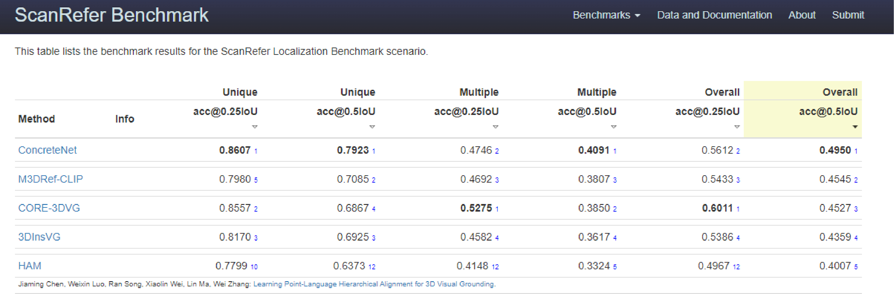

# Four Ways to Improve Verbo-visual Fusion for Dense 3D Visual Grounding
Code release for the paper [**Four Ways to Improve Verbo-visual Fusion for Dense 3D Visual Grounding**](https://ouenal.github.io/concretenet/), ECCV 2024. <br>
**Authors**: Ozan Unal, Christos Sakaridis, Suman Saha, Luc Van Gool <br>

:star2: ConcreteNet is ranked **1st** on the ScanRefer online benchmark (08.2023-09.2024)!

**Abstract**: 3D visual grounding is the task of localizing the object in a 3D scene which is referred by a description in natural language. With a wide range of applications ranging from autonomous indoor robotics to AR/VR, the task has recently risen in popularity. A common formulation to tackle 3D visual grounding is grounding-by-detection, where localization is done via bounding boxes. However, for real-life applications that require physical interactions, a bounding box insufficiently describes the geometry of an object. We therefore tackle the problem of dense 3D visual grounding, i.e. referral-based 3D instance segmentation. We propose a dense 3D grounding network ConcreteNet, featuring four novel stand-alone modules that aim to improve grounding performance for challenging repetitive instances, i.e. instances with distractors of the same semantic class. First, we introduce a bottom-up attentive fusion module that aims to disambiguate inter-instance relational cues, next, we construct a contrastive training scheme to induce separation in the latent space, we then resolve view-dependent utterances via a learned global camera token, and finally we employ multi-view ensembling to improve referred mask quality. ConcreteNet ranks 1st on the challenging ScanRefer online benchmark and has won the ICCV 3rd Workshop on Language for 3D Scenes "3D Object Localization" challenge.

---

### News
**\[2024-06\]** ConcreteNet is accepted to ECCV 2024! <br>
**\[2023-09\]** ConcreteNet wins the ICCV 3rd Workshop on Language for 3D Scenes "3D Object Localization" challenge! <br>
**\[2023-08\]** ConcreteNet achieves 1st on the ScanRefer online benchmark! <br>



---

### Installation
For the installation, we recommend setting up a virtual environment:
```shell
python -m venv ~/venv/concretenet
source ~/venv/concretenet/bin/activate
pip install -r requirements.txt
```
Futhermore install the following dependencies:
- [google-sparsehash](https://anaconda.org/bioconda/google-sparsehash)
- [spconv2.x](https://github.com/traveller59/spconv)

Compile the external C++ and CUDA ops:
```shell
cd ./lib/dknet_ops
export CPATH=$SPARSEHASH_ROOT/include:$CPATH
python setup.py build_ext develop
cd ../segmentator
cd csrc && mkdir build && cd build
cmake .. \
-DCMAKE_PREFIX_PATH=`python -c 'import torch;print(torch.utils.cmake_prefix_path)'` \
-DPYTHON_INCLUDE_DIR=$(python -c "from distutils.sysconfig import get_python_inc; print(get_python_inc())")  \
-DPYTHON_LIBRARY=$(python -c "import distutils.sysconfig as sysconfig; print(sysconfig.get_config_var('LIBDIR'))") \
-DCMAKE_INSTALL_PREFIX=`python -c 'from distutils.sysconfig import get_python_lib; print(get_python_lib())'`
make && make install # After install, please do not delete this folder (as we only create a symbolic link)
python -c 'import dknet_ops, segmentator' # Check installation
```
For further information regarding the compilation of external ops, please consult respective repositories of [DKNet](https://github.com/W1zheng/DKNet) and [segmentator](https://github.com/Karbo123/segmentator).

### Data Preparation
To download the ScanNetv2 dataset, please refer to the [ScanNet project page](https://github.com/ScanNet/ScanNet). You will receive a `download-scannet.py` script after your request for the dataset is approved. ConcreteNet requires only a subset of ScanNetv2 which can be downloaded as (10GB):
```shell
python download-scannet.py -o SCANNET/DIR --type _vh_clean_2.ply
python download-scannet.py -o SCANNET/DIR --type .aggregation.json
python download-scannet.py -o SCANNET/DIR --type _vh_clean_2.0.010000.segs.json
```
Once the download is complete, process the training and validation splits:
```shell
cd dataloader
python prepare_scannet_data.py --scannet_dir SCANNET/DIR --scannet_metadata ./meta_data/scannetv2_train.txt
python prepare_scannet_data.py --scannet_dir SCANNET/DIR --scannet_metadata ./meta_data/scannetv2_val.txt
```
Fill in the `dataset: root_dir` field of each config file to point to SCANNET/DIR.
To download the ScanRefer dataset, please refer to the [ScanRefer project page](https://github.com/daveredrum/ScanRefer). You will receive a download link after filling the request form. Download the scanrefer data as well as the annotated viewpoints following the instructions and unzip the compressed files in SCANNET/DIR.


### Training
As ConcreteNet is built on a grounding-by-selection strategy, to be able to learn meaningful mappings from natural language prompts to 3D instances, (1) we first pretrain the 3D instance segmentation backbone, and (2) only then introduce end-to-end training with verbo-visual fusion. ConcreteNet was trained with only a single Nvidia RTX 3090.

**Step 1** can be trained as follows. Alternatively, this step can be skipped by directly downloading the provided checkpoint file [here](https://drive.google.com/file/d/1OCik7Yto60k9tFzMyDBs5JRZV-f1fFdr/view?usp=drive_link).
```bash
python train.py --config_path config/pretraining.yaml
```
For **Step 2**, we provide the checkpoint from step 1. The resulting model state_dict can be downloaded [here](https://drive.google.com/file/d/1a6FQcFcebP7lg1VmhAw6JGIVW6ReePbL/view?usp=drive_link) (43.84% Acc@50).
```bash
python train.py --config_path config/concretenet.yaml --ckpt_path STEP1/CKPT/PATH
```
The `--resume` argument can be used to resume training from the last saved checkpoint.


### Evaluation
The final model as well as the provided intermediate checkpoints can be evaluated on both the ScanNetv2 and ScanRefer validation sets as follows:
```bash
python train.py --config_path config/pretraining.yaml --ckpt_path STEP1/CKPT/PATH --evaluate
python train.py --config_path config/concretenet.yaml --ckpt_path STEP2/CKPT/PATH --evaluate
```
The validation performance for the trained model is given below. Alternative to providing a checkpoint path, the `--resume` argument can once again be used to evaluate the last saved checkpoint. The evaluation dataset is detemined by the `dataset: prefix` field of the respective config file.

| Unique@25 | Unique@50 | Multiple@25 | Multiple@50 | Overall@25 | Overall@50 |
|:---------:|:---------:|:-----------:|:-----------:|:----------:|:----------:|
|   82.39   |   75.62   |    41.24    |    36.56    |    48.91   |    43.84   |

Evaluation with MVE can be done as follow:
```bash
python eval.py --config_path config/pretraining.yaml --ckpt_path CKPT/PATH
```

| Unique@25 | Unique@50 | Multiple@25 | Multiple@50 | Overall@25 | Overall@50 |
|:---------:|:---------:|:-----------:|:-----------:|:----------:|:----------:|
|   86.40   |   82.05   |    42.41    |    38.39    |    50.61   |    46.53   |

### Quick Access for Download Links:
- [Pretrained checkpoint](https://drive.google.com/file/d/1OCik7Yto60k9tFzMyDBs5JRZV-f1fFdr/view?usp=drive_link) (121MB).
- [Final checkpoint](https://drive.google.com/file/d/1a6FQcFcebP7lg1VmhAw6JGIVW6ReePbL/view?usp=drive_link) (580MB).
---

### Citation

If you use our dataset or our work in your research, please cite:

```bibtex
 @InProceedings{unal2024ways,
      author = {Unal, Ozan and Sakaridis, Christos and Saha, Suman and Van Gool, Luc},
      title = {Four Ways to Improve Verbo-visual Fusion for Dense 3D Visual Grounding},
      booktitle = {European Conference on Computer Vision (ECCV)},
      month = {October},
      year = {2024}
      }
}
```

### Acknowledgements
This work is funded by Toyota Motor Europe via the research project [TRACE-Zurich](https://trace.ethz.ch) (Toyota Research on Automated Cars Europe).
We would like to additionally thank the authors of the open source codebases [ScanRefer](https://github.com/daveredrum/ScanRefer), [3DVG-Transformer](https://github.com/zlccccc/3DVG-Transformer) and [DKNet](https://github.com/W1zheng/DKNet).

### License
This software is made available for non-commercial use under a creative commons [license](LICENSE). You can find a summary of the license [here](https://creativecommons.org/licenses/by-nc/4.0/).
